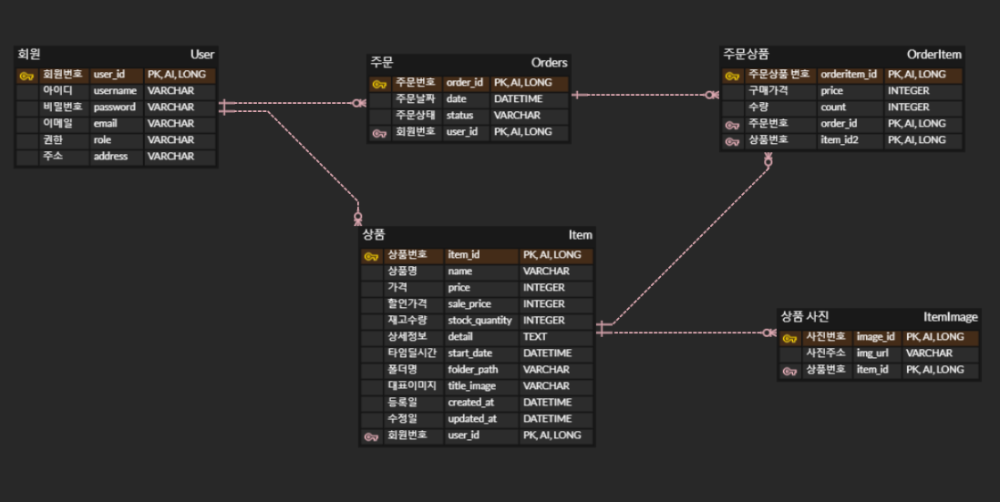

# time-deal-server

정해진 시간에 제한된 수량의 상품을 파는 타임 딜 서비스

### 기술 스택

---

### 핵심 기능

---

[회원] 가입/탈퇴/로그인/로그아웃 기능

[상품] 등록/수정/삭제/목록/상세 기능

[구매] 구매하기 기능

[마이페이지] 주문 내역 조회/ 등록 상품 조회

### ERD

---

### API 명세

---

:spiral_notepad:[API 명세](https://www.notion.so/sjjin/661d1e2b74984d9288f622aaa1f926ad?v=3b220cd61e61492992b549cd4538975b&pvs=4)

### 와이어 프레임

---

